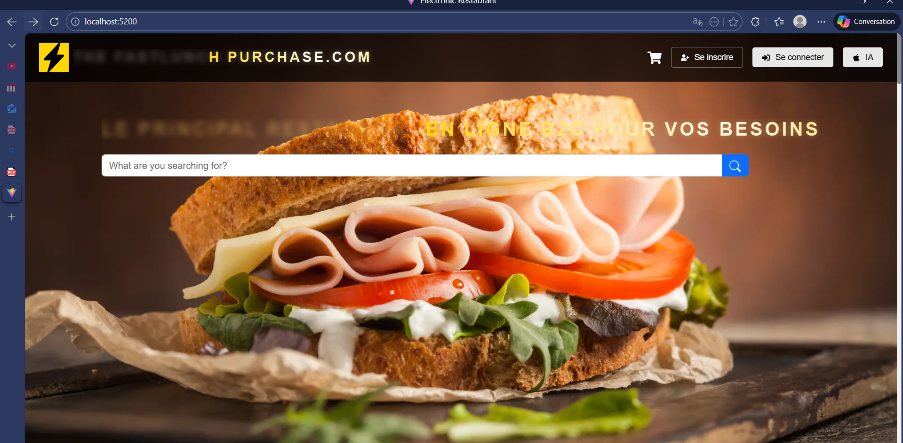
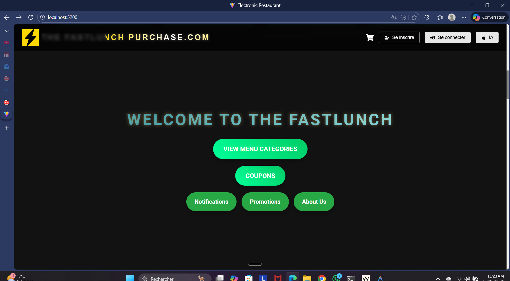
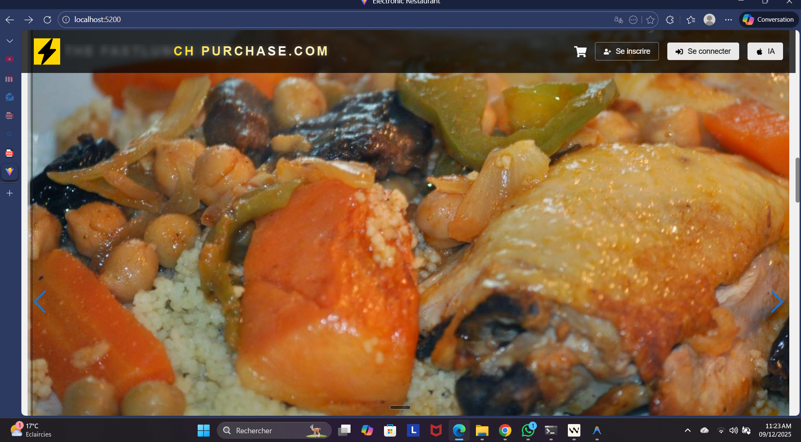
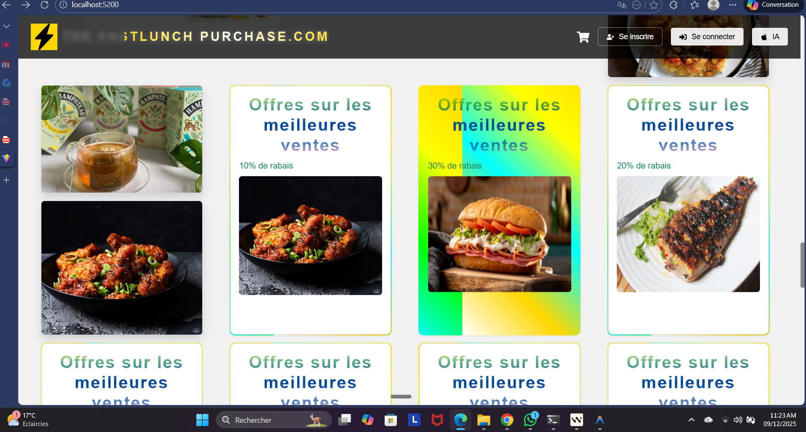

# Restaurant Mobile Application
* **Login Screen**
    

* **Menu Browsing**
    

* **Shopping Cart**
    

* **Checkout Page**
    
A modern, cross-platform mobile application for a restaurant, built with React Native and Django REST framework. This application allows users to browse the menu, view food items, add them to cart, and place orders.

## Features

- **User Authentication**: Secure login system for customers
- **Menu Browsing**: Browse food categories and view detailed item information
- **Food Discovery**: View popular dishes and featured items
- **Shopping Cart**: Add/remove items and manage quantities before checkout
- **Responsive Design**: Works on both iOS and Android devices
- **Modern UI/UX**: Clean, intuitive interface with smooth navigation

## Tech Stack

### Frontend
- **React Native** - Cross-platform mobile framework
- **TypeScript** - Type-safe JavaScript
- **React Navigation** - Routing and navigation
- **Redux** (optional) - State management (if implemented)

### Backend
- **Django REST Framework** - RESTful API development
- **SQLite/PostgreSQL** - Database
- **JWT Authentication** - Secure user authentication

## Project Structure

```
Restaurant/
├── frontend/                 # React Native frontend code
├── backendRestaurant/        # Django backend code
├── mobile/                   # Mobile-specific configurations
├── api.ts                   # API service layer
├── Cart.tsx                 # Shopping cart component
├── Login.tsx                # Authentication screen
├── Menu.tsx                 # Menu listing component
├── ProductDetail.tsx        # Product details screen
└── Profile.tsx              # User profile management
```

## Getting Started

### Prerequisites

- Node.js (v14 or later)
- npm or yarn
- React Native CLI
- Python 3.8+
- pip

### Installation

1. **Clone the repository**
   ```bash
   git clone [repository-url]
   cd Restaurant
   ```

2. **Setup Backend**
   ```bash
   cd backendRestaurant
   python -m venv venv
   source venv/bin/activate  # On Windows: .\venv\Scripts\activate
   pip install -r requirements.txt
   python manage.py migrate
   python manage.py runserver
   ```

3. **Setup Frontend**
   ```bash
   cd ../frontend
   npm install
   npx react-native start
   ```

4. **Run the Application**
   ```bash
   # For Android
   npx react-native run-android
   
   # For iOS
   cd ios && pod install && cd ..
   npx react-native run-ios
   ```

## Configuration

Update the API base URL in `api.ts` to point to your backend server:

```typescript
const API_URL = 'http://your-backend-url:8000/api';
```

## Features in Detail

### Authentication
- User login with JWT tokens
- Secure credential storage
- Session management

### Menu System
- Categorized food items
- Detailed product views with images and descriptions
- Search and filter functionality

### Order Management
- Add/remove items from cart
- Adjust quantities
- View order history

## Contributing

1. Fork the repository
2. Create your feature branch (`git checkout -b feature/AmazingFeature`)
3. Commit your changes (`git commit -m 'Add some AmazingFeature'`)
4. Push to the branch (`git push origin feature/AmazingFeature`)
5. Open a Pull Request

## License

This project is licensed under the MIT License - see the [LICENSE](LICENSE) file for details.

## Support

For support, email support@restaurantapp.com or open an issue in the repository.
